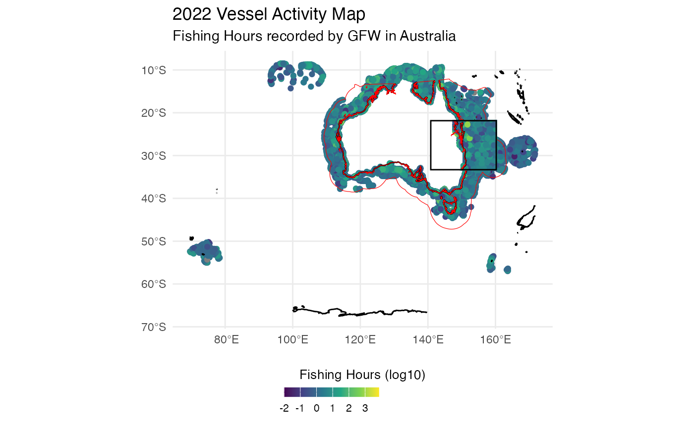

# Global Fishing Watch

## Global Fishing Watch R Package (`gfwr`)

The `gfwr` package provides convenient functions to pull GFW data
directly into R into usable formats. It contains three main functions,
including :
[`get_vessel_info()`](https://globalfishingwatch.github.io/gfwr/reference/get_vessel_info.html),
[`get_event()`](https://globalfishingwatch.github.io/gfwr/reference/get_event.html)
and
[`get_raster()`](https://globalfishingwatch.github.io/gfwr/reference/get_raster.html).
The two first being devoted to retrieving information and features on
one ore several specific vessels. The last is of particular interest to
us because it allows us to gather information from global fishing watch
raster on the fishing effort (further details in the function
appropriate section). Here we mainly use the `splnr_get_gfw` function
which has been created to enable data to be retrieved and processed in a
variety of ways, some of which are described here.

The time spent fishing is computed using Automatic Identification System
(AIS) data, which is transmitted by most industrial fishing vessels. The
AIS data provides information on the location, speed, and direction of
the vessel, which can be used to identify when the vessel is actively
fishing.

#### AIS Caveats and limitations

The AIS coverage of vessels has several limitations such as:  
1. The number of vessels that are captured (AIS provides approximately
70’000 of the 2.8 million identified fishing vessels).  
2. The size of the vessels (52-85% for vessels larger than 24 meters
against 1% for vessels under 12 meters).  
*Good to know: IMO mandates AIS for most vessels larger than 36
meters.*  
3. AIS interference with each other in areas of high vessel density.  
4. Some terrestrial satellites only receive messages near shore.

### Installation

``` r

remotes::install_github("GlobalFishingWatch/gfwr")
```

``` r

library(gfwr)
library(spatialplanr)
```

### API

To access GFW APIs, you need to :  
1. register for a GFW account [here](http://bit.ly/447cRG9).  
2. Request API key
[here](https://globalfishingwatch.org/our-apis/tokens).

Once you have your token, add it to your .Renviron file (by executing
the chunk below), by writing (GFW_TOKEN = “YOUR_TOKEN”) in the file.  
*(You could be asked to restart R for changes to take effect.)*

``` r

usethis::edit_r_environ()
```

### Fishing effort visualization

A region_id is necessary to use the `get_raster` function.

``` r

region_id <- get_region_id(region = "Australia", 
                                 region_source = "EEZ",
                                 key = gfwr::gfw_auth())$id[2]
```

The `get_raster` function gets a raster of fishing effort from the API
and converts the response to a data frame which contains occurrences for
each vessel and for each grid cell (data is binned into grid cells of
different resolution), the `Vessel IDs`, `Flag`, `Geartype` and
`Apparent fishing Hours` which are basically the amount of fishing hours
of each vessel per grid cell (`geometry`).

Data can be provided through :  
- `DAILY`, `MONTHLY` and `YEARLY` temporal resolutions.  
- `LOW` (0.1 deg) and `HIGH` (0.01 deg) spatial resolutions.  
- `VESSEL_ID`, `FLAG`, `GEARTYPE`, `FLAGANDGEARTYPE`.

``` r

get_raster(
  spatial_resolution = "LOW",
  temporal_resolution = "MONTHLY",
  group_by = "FLAGANDGEARTYPE",
  start_date = "2022-01-01",
  end_date = "2023-01-01",
  region = region_id,
  region_source = "EEZ",
  key = gfwr::gfw_auth()
)
```

*(You can remove the option* `message = FALSE` *to see the columns
types.)*

#### `get_raster` caveats and limitations.

Date range is limited to 1-year. Nevertheless, with some modifications,
we can get round these problems through `splnr_get_gfw`.

``` r

data_sf_combined <- splnr_get_gfw(region = "Australia", 
                                  start_date = "2019-01-01",
                                  end_date =  "2023-12-31",
                                  temp_res = "YEARLY",
                                  spat_res = "LOW",
                                  compress = FALSE)
```

### Visualization

To display the data, we load :  
- The coastline from `rnaturalearth` package and modify it to get an sf
object, and we constrain it to the boundaries of the given data.  
- EEZ Polygons from `oceandatr` package

``` r

# Check and modify if necessary the spatial reference of data_sf_combined
data_sf_combined <- sf::st_set_crs(data_sf_combined, 
                                   sf::st_crs(rnaturalearth::ne_coastline(scale = "large")))

coast_clipped <- rnaturalearth::ne_coastline(scale = "large") %>%
  sf::st_as_sf() %>%
  sf::st_intersection(sf::st_as_sfc(sf::st_bbox(data_sf_combined)))

# Load EEZ polygons
eezs <- spatialgridr::get_boundary(name = "Australia", type = "eez", country_type = "country") %>%
  sf::st_transform(crs = sf::st_crs(data_sf_combined)) %>%
  sf::st_make_valid() %>%
  sf::st_intersection(sf::st_as_sfc(sf::st_bbox(data_sf_combined)))
```

### Here we display the Fishing Effort in Australia from 2019 to 2023.

#### Raw Fishing Effort


#### By years



#### Year-on-year comparison

We may need to compare different timeframes, such as seasons, to see if
there are any patterns.  
**Note :** As more vessels have adopted AIS (mainly in economically
developed countries) since the deployment of these technologies, the
rise in activities must be seen in the context of this increase and not
necessarily of more intense fishing activity.

``` r

# We need to change the temporal range according to our need group by it to display the total fishing hours. <br>
data_sf_combined <- splnr_get_gfw(region = "Australia", 
                                  start_date = "2019-01-01", 
                                  end_date = "2023-12-31", 
                                  temp_res = "MONTHLY", 
                                  key = gfwr::gfw_auth()) %>%
  dplyr::group_by(Year, Month) %>%
  dplyr::summarize(Total_Fishing_Hours = sum(ApparentFishingHrs))
```


#### Fishing gear type

Here we display the Vessel activity in ‘Micronesia’ in 2020 according to
the fishing gear type.

``` r

data_sf_combined <- splnr_get_gfw(region = "Micronesia", 
                                  start_date = "2019-12-31", 
                                  end_date = "2021-01-01", 
                                  temp_res = "MONTHLY")
```


#### Flags

Here we display the Vessel activity in Papua New Guinea according to
Vessels flags.


#### Supplementary materials.

The fishing detection model was trained on AIS data from 503 vessels and
identified fishing activity with over 90% accuracy, which means that it
can identify a fishing and non-fishing activity with high accuracy. More
details on AIS operation and limitations
[here](https://globalfishingwatch.org/dataset-and-code-fishing-effort/).

#### Hierarchy of vessels gear types :

  

*Source :
<https://globalfishingwatch.org/datasets-and-code-vessel-identity/>*
