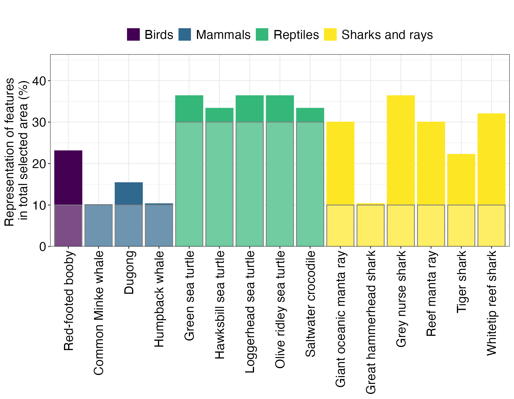

# A Basic Spatial Planning Workflow

``` r

library(spatialplanr)
```

## Overview

This code has been written to simplify the process for running a
*prioritizr* analysis on a given region. It is still a work in progress
so feel free to submit pull requests with new features and code
improvements.

### Set user parameters

You can set a region if it is defined in `splnr_get_planningUnits`.

``` r

Region <- "Coral Sea" # "Australia"
Type <- "Oceans" # "EEZ"
```

You can also define a region with square boundaries (in degrees) if you
need.

``` r

Region <- c(xmin = 150, xmax = 160, ymin = -40, ymax = -30)
```

Choose CRS for analysis. In this case we use Mollweide

``` r

cCRS <- "ESRI:54009"
```

Set the diameter of the planning units. This will be in the same units
as the CRS (usually metres or degrees).

``` r

PU_size <- 107460 # m
```

### Analysis Region

Start your analysis by defining your region and setting up the planning
units.

Get the boundary for your chosen region.

``` r

Bndry <- splnr_get_boundary(Limits = Region, Type = Type, cCRS = cCRS)
```

Get the land boundaries to remove overlap. The object “landmass”
represents the land mass that should be removed (inverse = FALSE)

``` r

landmass <- rnaturalearth::ne_countries(
  scale = "medium",
  returnclass = "sf"
) %>%
  sf::st_transform(cCRS)
```

### Create Planning Units

``` r

PUs <- spatialgridr::get_grid(boundary = Bndry, 
                              crs = cCRS,
                              output = "sf_hex", 
                              resolution = PU_size)
```

We can check what the PUs look like

``` r

(ggPU <- splnr_plot(df = PUs) +
   ggplot2::theme_bw()) # Plot Planning Units
```


If we want to add additional properties to our map, for example landmass
or the boundary, we can use
[`splnr_gg_add()`](https://mathmarecol.github.io/spatialplanr/reference/splnr_gg_add.md).

``` r

(ggPU <- splnr_plot(df = PUs) +
   splnr_gg_add(
     Bndry = Bndry, overlay = landmass,
     cropOverlay = PUs, ggtheme = "Default"
   ))
```


We can also use a customised `ggplpot` theme that can be passed as a
list to
[`splnr_gg_add()`](https://mathmarecol.github.io/spatialplanr/reference/splnr_gg_add.md)
and that can then be used for all plots. For example:

``` r

splnr_theme <- list(
  ggplot2::theme_bw(),
  ggplot2::theme(
    legend.position = "right",
    legend.direction = "vertical",
    text = ggplot2::element_text(size = 9, colour = "black"),
    axis.text = ggplot2::element_text(size = 9, colour = "black"),
    plot.title = ggplot2::element_text(size = 9),
    axis.title = ggplot2::element_blank()
  )
)

(ggPU <- splnr_plot(PUs) +
    splnr_gg_add(
      Bndry = Bndry, overlay = landmass,
      cropOverlay = PUs, ggtheme = splnr_theme
    ))
```


### Get the features

For our example, we will use a small subset of charismatic megafauna
species of the Coral Sea to inform the conservation plan. We filtered
the Aquamaps (Aquamaps.org) species distribution models for our study
area for the following species:

``` r

Dict <- tibble::tribble(
  ~nameCommon, ~nameVariable, ~category, 
  "Green sea turtle", "Chelonia_mydas", "Reptiles", 
  "Loggerhead sea turtle", "Caretta_caretta", "Reptiles", 
  "Hawksbill sea turtle", "Eretmochelys_imbricata", "Reptiles", 
  "Olive ridley sea turtle", "Lepidochelys_olivacea", "Reptiles", 
  "Saltwater crocodile", "Crocodylus_porosus", "Reptiles", 
  "Humpback whale", "Megaptera_novaeangliae", "Mammals", 
  "Common Minke whale", "Balaenoptera_acutorostrata", "Mammals", 
  "Dugong", "Dugong_dugon", "Mammals", 
  "Grey nurse shark", "Carcharias_taurus", "Sharks and rays", 
  "Tiger shark", "Galeocerdo_cuvier", "Sharks and rays", 
  "Great hammerhead shark", "Sphyrna_mokarran", "Sharks and rays", 
  "Giant oceanic manta ray", "Mobula_birostris", "Sharks and rays", 
  "Reef manta ray", "Mobula_alfredi", "Sharks and rays", 
  "Whitetip reef shark", "Triaenodon_obesus", "Sharks and rays",
  "Red-footed booby", "Sula_sula", "Birds"
)
```

These species were not chosen based on their importance for this region
and only represent an example for visualization purposes.

**Note:** The structure of the `tribble`above is required for some of
the downstream plotting. *Common* denotes the common name of a species,
*nameVariable* the scientific name in the format used by Aquamaps,
*TaxGroup* is the taxonomic grouping that a species belongs to and
*Category* represents the importance of the species for the conservation
plan.

#### Convert the probabilities to binary data

``` r

datEx_species_bin <- spDataFiltered %>%
  splnr_apply_cutoffs(Cutoffs = 0.5)
```

We can now look at the feature data used for the spatial plan
individually by calling
[`splnr_plot_binFeature()`](https://mathmarecol.github.io/spatialplanr/reference/splnr_plot_binFeature.md),
for example to see the binary habitat suitability map for Green sea
turtles:

``` r

(ggFeature1 <- splnr_plot(
  df = datEx_species_bin,
  colNames = "Chelonia_mydas",
  plotTitle = "Chelonia mydas",
  legendLabels = c("Absence", "Presence")
) +
  splnr_gg_add(
    PUs = PUs, Bndry = Bndry, overlay = landmass,
    cropOverlay = PUs, ggtheme = splnr_theme
  )
)
```


The suitable habitat for Green sea turtles as predicted by Aquamaps is
restricted to few cells close to the coast. If we now compare this with
the predicted suitable habitat for Humpback whales, we can see that they
are fairly ubiquitous across the whole Coral Sea.

``` r

(ggFeature <- splnr_plot(
  datEx_species_bin,
  "Megaptera_novaeangliae",
  plotTitle = "Megaptera novaeangliae"
) +
  splnr_gg_add(
    PUs = PUs, Bndry = Bndry, overlay = landmass,
    cropOverlay = PUs, ggtheme = splnr_theme
  ))
```


In our example, this was the only reason why we classified species as
either representative if their suitable habitat is wide-ranging within
the study region or important if they are restricted to a few number of
cells.

To get a better idea of the overall distribution of the used features,
we can also plot the number of features with suitable habitat within a
Planning Unit of the study region.

``` r

(ggFeatNo <- splnr_plot(df = datEx_species_bin, 
                        colNames =  colnames(datEx_species_bin %>% 
                                                sf::st_drop_geometry()),
                        plotTitle = "", 
                        legendTitle = "Number of features") +
   splnr_gg_add(
     PUs = PUs, Bndry = Bndry, overlay = landmass,
     cropOverlay = PUs, ggtheme = splnr_theme
   ))
```


### Prepare Data for prioritization

For the spatial prioritization we also need to extract the names of our
features to pass into `prioritizr`.

``` r

feature_names <- splnr_featureNames(datEx_species_bin)
```

We also create an `sf` object that contains all the information needed
for the prioritization.

``` r

out_sf <- datEx_species_bin
```

##### Add Cost

In our example, we use a minimum set objective function, which aims to
minimize the cost whilst meeting all the conservation targets. We add an
area-based cost to include as little area as possible in the spatial
plan whilst meeting the conservation targets. For this, all the planning
units are assigned an equal cost of 1.

``` r

out_sf$Cost_None <- 1
(ggCost <- splnr_plot(out_sf, colNames = "Cost_None", 
                      legendTitle = "Cost", legendLabels = "1") +
    splnr_gg_add(
      PUs = PUs, Bndry = Bndry, overlay = landmass,
      cropOverlay = PUs, ggtheme = splnr_theme
    ))
```


###### Other features

###### Fishing effort

The gfwr package allows us to recover data from fisheries across the
world, we set here the parameter `compress` as `TRUE` to recover the
`Apparent fishing hours` per coordinates.

``` r

gfw_data <- splnr_get_gfw(region = 'Australia', 
                          start_date = "2022-01-01", 
                          end_date = "2022-12-31", 
                          temp_res = "yearly", 
                          cCRS = cCRS, 
                          compress = TRUE) %>%
  sf::st_interpolate_aw(PUs, extensive = TRUE)

out_sf$Apparent.Fishing.Hours <- 0 # Add column to PUs
out_sf$Apparent.Fishing.Hours[as.numeric(rownames(PUs))] <- 
  gfw_data$Apparent.Fishing.Hours # Put corresponding data in PUs


(ggCost <- splnr_plot(out_sf, colNames = "Apparent.Fishing.Hours") +
    splnr_gg_add(
      PUs = PUs, Bndry = Bndry, overlay = landmass,
      cropOverlay = PUs, ggtheme = splnr_theme
    ))
```

###### Other features

Many features can be taken into account as cost layers before the
prioritization, we provide here different features from the
`oceandatr`package.

### Set Targets

As shown previously, we assigned the conservation features a class
reflecting their importance in the planning region. Conservation targets
are then assigned a target based on their class, in our case 30% of
suitable habitat of important and 10% of representative features.

``` r

catTarg <- c("Reptiles" = 0.3, "Mammals" = 0.1, "Sharks and rays" = 0.1, "Birds" = 0.1)

target <- Dict %>%
  splnr_targets_byCategory(catTarg, catName = "category")
```

**Note:** The assigned classes and targets were not based on any
ecological information and only chosen for visualization purposes.

### Set up conservation problem

``` r

datEx_problem <- prioritizr::problem(out_sf, feature_names, "Cost_None") %>%
  prioritizr::add_min_set_objective() %>%
  prioritizr::add_relative_targets(target$target) %>%
  prioritizr::add_binary_decisions() %>%
  prioritizr::add_default_solver(verbose = FALSE)
```

### Solve the conservation problem

``` r

datEx_soln <- datEx_problem %>%
  prioritizr::solve.ConservationProblem()
```

### Visualize Output

There are different ways to visualize the output of the prioritization
that can be loosely grouped into three categories: *+* Visualization of
the solution *+* Visualization of targets *+* Visualization of
importance scores

#### Visualization of the solution

``` r

(ggSoln <- splnr_plot(datEx_soln, 
                      colNames = "solution_1", 
                      legendTitle = "Solution", 
                      legendLabels = c("0","1")) +
   splnr_gg_add(
     PUs = PUs, Bndry = Bndry, overlay = landmass,
     cropOverlay = PUs, ggtheme = splnr_theme
   ))
```


This plot shows the optimal solution for the planning region that meets
the selected targets for the chosen features for the smallest area
possible. The categorical map displays, which of the planning units were
selected as important for meeting the conservation targets (dark blue)
and which were not selected (light blue). This can also be done with an
overlay of the cost to show how the solution avoids highly costly areas:

``` r

(ggCostOverlay <- splnr_plot_costOverlay(
  soln = datEx_soln,
  cost = NA,
  costName = "Cost_None"
) +
  splnr_gg_add(
    PUs = PUs, Bndry = Bndry, overlay = landmass,
    cropOverlay = PUs, ggtheme = splnr_theme
  ))
```


**Note:** In our example, cost is equal for all planning units.

#### Visualization of targets

To visualize how well the targets are met, we first need to extract how
much suitable habitat of each feature are selected in the spatial plan.
This also includes potential incidental coverage of feature that were
not included in the spatial plan but can still be found in the planning
region.

``` r

dfTarget <- splnr_get_featureRep(datEx_soln, datEx_problem,
                                 climsmart = FALSE, 
                                 solnCol = "solution_1"
)


(ggTarget <- splnr_plot_featureRep(dfTarget, 
                                   category = Dict, 
                                   renameFeatures = TRUE,
                                   namesToReplace = Dict, 
                                   categoryFeatureCol = "nameCommon",
                                   nr = 1, showTarget = TRUE,
))
```



For a circular bar plot, one additional step of data preparation needs
to be done.

``` r

dfTargetCirc <- dfTarget %>%
dplyr::select("feature", "value", "group") %>%
na.omit()

colors <- c(
  "important" = "darkgreen",
  "representative" = "darkred"
)
legends <- c("Important", "Representative")

(ggCircTarg <- splnr_plot_circBplot(df = dfTargetCirc, legend_list = legends, legend_color = colors, impTarget = 30, repTarget = 10))
```

#### Visualization of importance scores

Importance scores can help to assess the relative importance of an
individual selected Planning Unit in the spatial plan (for more
information, see <https://prioritizr.net/reference/importance.html>)

Here, we use two different importance scores, the Ferrier Score and
Rarity Weighted Richness.

``` r

ggFerrier <- splnr_plot_importanceScore(
  soln = datEx_soln,
  pDat = datEx_problem,
  method = "Ferrier",
  decimals = 4,
  legendTitle = "Importance Score \n(Ferrier Score)"
) +
  splnr_gg_add(
    PUs = PUs, Bndry = Bndry, overlay = landmass,
    cropOverlay = PUs, ggtheme = splnr_theme
  )
#> Calculating Ferrier Score.

ggRWR <- splnr_plot_importanceScore(
  soln = datEx_soln,
  pDat = datEx_problem,
  method = "RWR",
  decimals = 2,
  legendTitle = "Importance Score \n(Rarity Weighted Richness)"
) +
  splnr_gg_add(
    PUs = PUs, Bndry = Bndry, overlay = landmass,
    cropOverlay = PUs, ggtheme = splnr_theme
  )
#> Calculating Rarity Weighted Richness.

(ggScores <- patchwork::wrap_plots(ggFerrier + ggRWR))
```


In our example, both scores label similar -coastal- planning units as
most important for the spatial plan.

### Comparing Spatial Plans

Sometimes it can be useful to have a direct comparison of two spatial
plans. To show how to achieve this with this package, we first need a
second conservation problem and resulting solution.

Here, our second spatial plan will include already existing marine
protected areas in the area
(<https://www.protectedplanet.net/en/thematic-areas/wdpa?tab=WDPA>) with
the following characteristics: \* Status = c(“Designated”,
“Established”, “Inscribed”) \* Designation Type = c(“National”,
“Regional”, “International”, “Not Applicable”) \* IUCN Category =
c(“Ia”, “Ib”, “II”, “III”, “IV”)

``` r

# The user can download their own MPAs using this code,
# but below we use data already within the package.
LockedIn <- splnr_get_MPAs(PUs, "Australia") %>%
  splnr_apply_cutoffs(0.5) %>%
  dplyr::mutate(wdpa = as.logical(wdpa))
```

``` r

(ggMPA <- splnr_plot(MPAsCoralSea, "wdpa") +
   splnr_gg_add(
     PUs = PUs, Bndry = Bndry, overlay = landmass,
     cropOverlay = PUs, ggtheme = splnr_theme
   ))
```


We will also include targets based on IUCN categories to prioritise
species with an IUCN status of:

- Vulnerable
- Endangered
- Critically Endangered
- Extinct in the Wild
- Extinct

We assign a 30% target to species within these categories. All species
that do not fall into any of these categories receive an inverse area
target, so species with a greater area of suitable habitat are assigned
a lower target.

``` r


minTarget <- 0.1
maxTarget <- 0.2

# Create inverse area target
IA_Targets <- splnr_targets_byInverseArea(
  datEx_species_bin,
  minTarget,
  maxTarget
)
```

We can also adjust the targets based on the IUCN Category. Here we apply
an increased target of 0.3 for all species with an increased thread
level on the IUCN Red List(“EX”, “EW”, “CR”, “EN”, “VU”).

``` r


IUCN_IA_Targets <- IA_Targets %>%
  splnr_get_IUCNRedList(species_col = "Species") %>% # Add RL data to the df
  splnr_targets_byIUCN(IUCN_target = 0.3)
```

**Note:** Accessing the IUCN database requires a login token from
`rl_use_iucn()` that needs to be added to the environment using
`Sys.setenv(IUCN_REDLIST_KEY = "[Your Token]")`. You can start by
running
[`rredlist::rl_use_iucn()`](https://docs.ropensci.org/rredlist/reference/rl_use_iucn.html).

#### Set up second conservation problem

``` r

datEx_problem2 <- prioritizr::problem(out_sf, feature_names, "Cost_None") %>%
  prioritizr::add_min_set_objective() %>%
  prioritizr::add_relative_targets(IA_Targets$target) %>%
  prioritizr::add_locked_in_constraints(as.logical(MPAsCoralSea$wdpa)) %>%
  prioritizr::add_binary_decisions() %>%
  prioritizr::add_default_solver(verbose = FALSE)

# Add a solution object
datEx_soln2 <- datEx_problem2 %>%
  prioritizr::solve.ConservationProblem()

(ggSoln2 <- splnr_plot_solution(datEx_soln2) +
    splnr_gg_add(
      PUs = PUs, Bndry = Bndry, overlay = landmass,
      cropOverlay = PUs, ggtheme = splnr_theme
    ))
```


But we locked-in areas that were already existing Marine Protected Areas
(MPAs). If we want to show the overlap between the selected Planning
Units and the current MPAs, we can can add this to the
[`splnr_gg_add()`](https://mathmarecol.github.io/spatialplanr/reference/splnr_gg_add.md)
function.

``` r

(splnr_plot_solution(datEx_soln2) +
   splnr_gg_add(
     PUs = PUs, Bndry = Bndry, lockIn = MPAsCoralSea,
     nameLockIn = "wdpa", typeLockIn = "Full",
     colorLockIn = "lightgrey", alphaLockIn = 0.2, overlay = landmass,
     cropOverlay = PUs, ggtheme = splnr_theme
   ))
```


If we instead only want to see the contours of the locked-in areas we
can set `typeLockIn = "Contours"` in
[`splnr_gg_add()`](https://mathmarecol.github.io/spatialplanr/reference/splnr_gg_add.md).

``` r

(splnr_plot_solution(datEx_soln2) +
   splnr_gg_add(
     lockIn = MPAsCoralSea,
     nameLockIn = "wdpa", typeLockIn = "Contours",
     colorLockIn = "lightgrey", alphaLockIn = 0.2, overlay = landmass,
     cropOverlay = PUs, ggtheme = splnr_theme
   ))
```


#### Visualize comparison

``` r

(ggComp <- splnr_plot_comparison(datEx_soln, datEx_soln2) +
   splnr_gg_add(
     PUs = PUs, Bndry = Bndry, overlay = landmass,
     cropOverlay = PUs, ggtheme = splnr_theme
   ))
```


This plot shows how the first solution (without current MPAs) differs
from the second solution (including current MPAs. The categorical map
displays, which of the planning units were selected in solution 2 but
not in solution 1 (red), in solution 1 but not in solution 2 (blue), or
selected in both solutions (grey).

``` r

CorrMat <- splnr_get_kappaCorrData(list(datEx_soln, datEx_soln2),
                                   name_sol = c("soln1", "soln2")
)

(ggCorr <- splnr_plot_corrMat(CorrMat,
                              AxisLabels = c("Solution 1", "Solution 2")
))
```


The correlation matrix shows the similarity as the Cohen’s Kappa
correlation between solution 1 and solution 2.

#### Plotting selection frequency

Sometimes when multiple spatial plans are generated, we are interested
in how many times a Planning Unit is selected across the array of
solutions. To demonstrate how this can be done using this package, we
first create an array (= portfolio) of solutions. One example of this is
by using the portfolio

``` r

datEx_soln_portfolio <- datEx_problem %>%
  prioritizr::add_cuts_portfolio(5) %>% # create a portfolio of solutions
  prioritizr::solve.ConservationProblem()

selFreq <- datEx_soln_portfolio %>% # calculate selection frequency
  sf::st_drop_geometry() %>%
  dplyr::mutate(selFreq = as.factor(rowSums(
    dplyr::select(., dplyr::starts_with("solution_"))
  ))) %>%
  sf::st_as_sf(geometry = datEx_soln_portfolio$geometry) %>%
  dplyr::select(selFreq)

(ggselFreq <- splnr_plot_selectionFreq(selFreq) +
    splnr_gg_add(
      PUs = PUs, Bndry = Bndry, overlay = landmass,
      cropOverlay = PUs, ggtheme = splnr_theme
    ))
```


